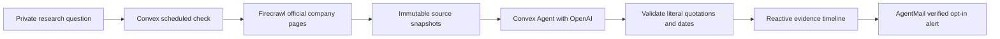

# ThesisLine

ThesisLine keeps a research question attached to a company, then tracks the official disclosures that help answer it. Each finding includes an AI reading, exact quotations, a dated source capture and a link to the original company document.

[Open ThesisLine](https://resolute-akita-616.convex.site/) · [Watch the 1:37 walkthrough](https://drive.google.com/file/d/1dUeHLHe0Lagy2sREmg5PRBxu3pppB1tw/view) · [Source](https://github.com/himanshu748/thesisline) · [Build record](./hackathon.md)

The public app, repository and walkthrough are live. [GitHub Actions passed](https://github.com/himanshu748/thesisline/actions/runs/34685625584) for release commit [`6eac7a7`](https://github.com/himanshu748/thesisline/commit/6eac7a7) on September 12, 2026. The [Vibe Apps entry](https://vibeapps.dev/s/thesisline) was submitted through the All Gas hackathon form on September 12, 2026.

## Try it

Explore the fictional Northstar walkthrough without an account. To use real sources, create an account, choose Infosys or ITC, and write a question such as “Has Infosys changed its revenue-growth guidance?” Your first check runs in the background and appears in the private evidence timeline. Open a quotation to inspect its captured source.

Daily checks are optional. Email alerts require address verification and a separate opt-in for each question. Alerts report newly saved evidence; an unchanged check adds no duplicate finding. You can disable alerts or archive a question from its workspace.

Initial coverage is **Infosys and ITC**. This is company-disclosure research, with no price feed, option-chain analysis, broker integration or order execution.

## How it works



- **Convex** owns Password Auth, account access, watches, snapshots, event history, scheduled checks and transactional rate limits. The frontend uses live subscriptions. Agent, Rate Limiter and Static Hosting are installed Convex components.
- **Firecrawl** retrieves at most three curated official pages or linked disclosures per check. The capture limit is 24,000 characters per page. Source hashes preserve versions and avoid repeating an unchanged extraction.
- **OpenAI**, through Vercel AI Gateway and the Convex Agent component, reads the captured documents against the saved question. A finding is rejected if its quotation cannot be located in its cited snapshot. The interpretation remains model-generated and should be reviewed.
- **AgentMail** sends verification codes and opted-in evidence alerts. Frozen outbox payloads and stable idempotency keys limit duplicate deliveries across retries. The pilot uses an existing shared sender; message content identifies ThesisLine. It does not process incoming email replies.

## Run locally

Use Node 22 or later and your own Convex account.

```sh
npm ci
npx convex dev --once
```

Set `VITE_CONVEX_URL` in `.env.local` to the `.convex.cloud` URL printed by Convex. The CLI also writes the deployment selection there. Do not commit this file.

Configure fresh auth keys for your selected deployment:

```sh
node scripts/configure-auth.mjs YOUR_DEPLOYMENT https://YOUR_DEPLOYMENT.convex.site
```

This script refuses to replace an existing signing key. It sends generated credentials directly to the named Convex deployment without printing or storing them locally.

Set backend secrets with the CLI's interactive input so values do not enter shell history:

```sh
npx convex env set FIRECRAWL_API_KEY
npx convex env set AI_GATEWAY_API_KEY
npx convex env set AGENTMAIL_API_KEY
npx convex env set AGENTMAIL_INBOX_ID
```

The AI Gateway key must permit the OpenAI model configured in `convex/research.ts`. AgentMail needs send access for the configured inbox. Missing provider configuration produces an explicit unavailable or failed-check state, preserving earlier evidence.

```sh
npx convex dev --once
npm run dev
```

## Checks and publishing

```sh
npm test
npm run typecheck
npm run format:check
npm run lint
npm run build
npm run deploy:pilot
```

`deploy:pilot` publishes to the **selected development deployment** with Convex Static Hosting (the CLI default target). This repository's public hackathon pilot deliberately uses a dedicated development deployment. Select and verify your deployment before uploading; the production target is separate.

See [EVIDENCE.md](./EVIDENCE.md) for verified behavior and remaining limitations. Provider tests use an owned inbox and private QA account. Their credentials, raw snapshots, recordings and operational logs stay outside the public repository.

## Operational limits

Each account can keep 10 active questions and run 30 checks per day. The pilot additionally caps all research at 100 checks per day and 20 per hour. Daily work is queued in bounded batches. Alerts are capped at 10 per account and 30 globally per day, with at most three delivery attempts within one hour. Email codes expire after 15 minutes and permit five guesses.

A check covers a selection of pages, not every disclosure. Historical documents can appear during the first check; event dates and capture times are shown separately. A changed source version can create new evidence even if the underlying business fact is similar. Archive stops future work but does not delete stored records. There is no self-service account deletion or password recovery yet.

## Repository boundaries

Public: application and backend source, deterministic fixtures, tests, lockfile, setup script, architecture, product/design notes and this build record.

Local only: `.env*` secrets, provider receipts, QA credentials, screenshots, recordings, X drafts, launch scripts and storyboards. See `.gitignore`.
